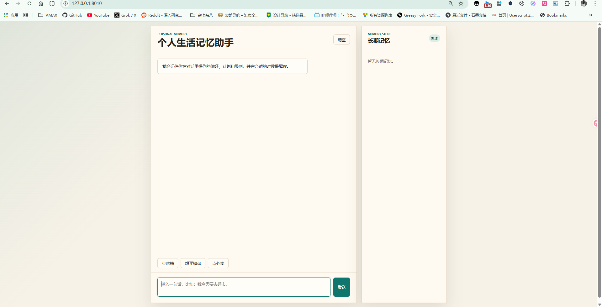
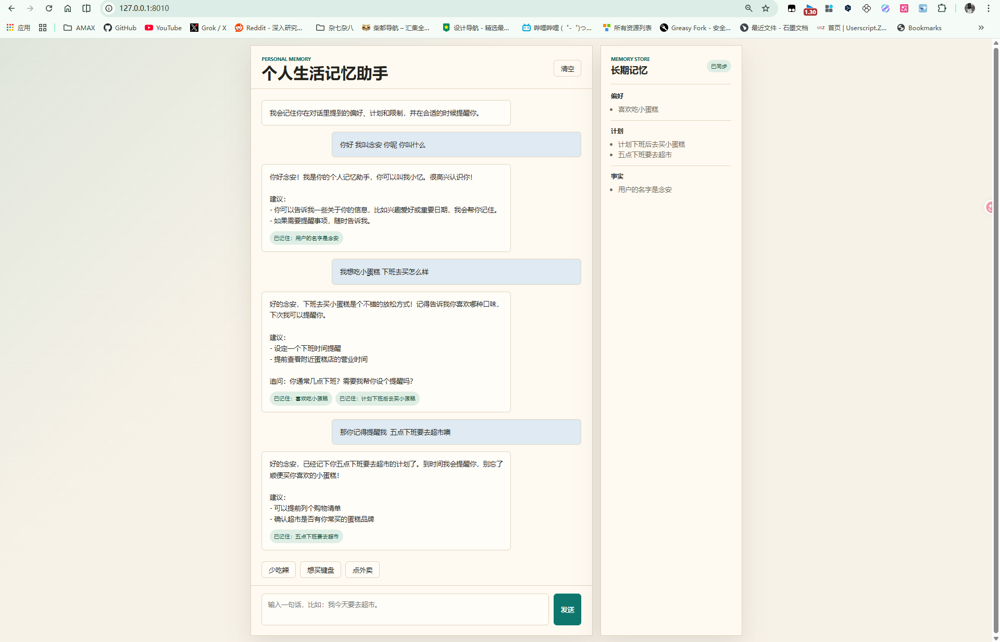
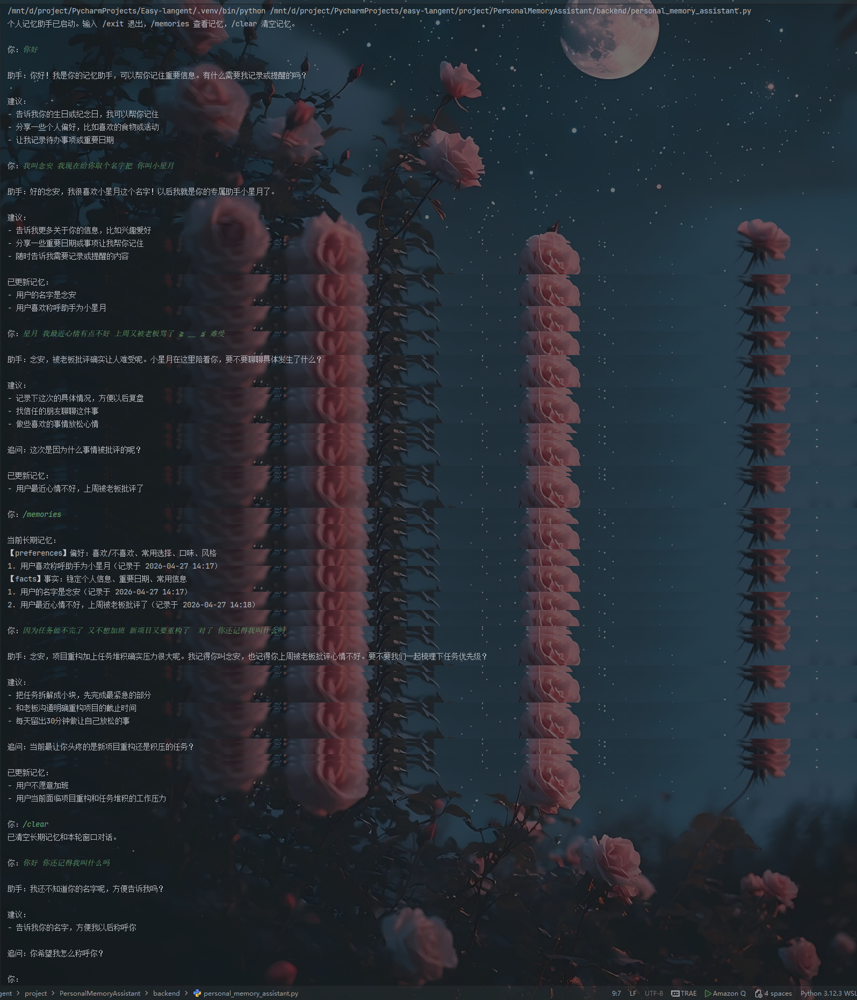

# PersonalMemoryAssistant

个人生活记忆助手是一个贴近日常使用场景的 LangChain 多轮问答 Demo。它会从用户对话中提取长期记忆，例如个人偏好、近期计划、身体或时间限制、稳定事实，并在后续对话中结合当前场景给出提醒。

## 效果展示







## 适用场景

用户可以像日常聊天一样输入：

```text
我最近胃不太舒服，先少吃辣。
我上周说想买一个机械键盘。
我不喜欢太甜的奶茶。
```

之后当用户输入：

```text
我今天准备点外卖。
```

助手会结合已记录的信息回复：

```text
你最近胃不太舒服，今天点外卖建议先避开重辣和油炸类。

建议：
- 可以选粥、清汤面或清淡盖饭
- 饮品尽量选择少糖或无糖
```

## 技术链路

本项目覆盖以下 LangChain 组件：

```text
用户输入
-> 窗口记忆加载最近几轮对话
-> 读取 memory_store.json 中的长期记忆
-> ChatPromptTemplate 整合长期记忆、历史对话和当前问题
-> Runnable 构建回答链
-> ChatOpenAI 调用模型
-> JsonOutputParser 解析结构化回答
-> 展示结果
-> 记忆抽取链提取新记忆
-> 更新 memory_store.json 和窗口 Memory
```

窗口记忆负责理解最近几轮上下文，长期记忆文件负责保存跨会话仍然有价值的信息。代码会优先尝试使用 `ConversationBufferWindowMemory`；如果当前 LangChain 版本已迁移该类，则使用脚本内置的等价窗口记忆实现。

## 项目结构

```text
project/PersonalMemoryAssistant/
├── Readme.md
├── __init__.py
├── backend/
│   ├── .env.example
│   ├── assistant.py          # LangChain 个人记忆助手核心逻辑
│   ├── personal_memory_assistant.py  # CLI 入口
│   ├── requirements.txt
│   └── server.py             # HTTP API + 静态文件服务
├── frontend/
│   ├── index.html
│   ├── styles.css
│   └── app.js
├── images/
│   ├── img.png
│   ├── img_1.png
│   └── img_2.png
└── memory_store.json        # 首次运行并产生记忆后自动生成
```

## 环境变量

可以参考 `backend/.env.example` 在 `project/PersonalMemoryAssistant/backend/.env` 或 `project/PersonalMemoryAssistant/.env` 中配置：

```env
API_KEY=你的模型 API Key
BASE_URL=你的模型服务地址
MODEL=deepseek-chat
```

如果使用 OpenAI 官方兼容变量，也支持：

```env
OPENAI_API_KEY=你的 OpenAI API Key
OPENAI_BASE_URL=https://api.openai.com/v1
MODEL=gpt-4o-mini
```

## 运行 Web 版本

在仓库根目录执行：

```bash
.venv/bin/python project/PersonalMemoryAssistant/backend/server.py
```

可选参数：

```bash
.venv/bin/python project/PersonalMemoryAssistant/backend/server.py --port 8010
.venv/bin/python project/PersonalMemoryAssistant/backend/server.py --memory-file ./my_memory.json
```

启动后访问：

```text
http://127.0.0.1:8010
```

## 后端接口

```text
GET  /api/health    健康检查
GET  /api/memories  查看长期记忆
POST /api/chat      发送用户消息
POST /api/clear     清空长期记忆和本轮窗口对话
```

`POST /api/chat` 请求体：

```json
{
  "message": "我今天准备点外卖。"
}
```

## CLI 版本

如果只想在终端里测试，也可以执行：

```bash
.venv/bin/python project/PersonalMemoryAssistant/backend/personal_memory_assistant.py
```

可用命令：

```text
/memories  查看当前长期记忆
/clear     清空长期记忆和当前窗口对话
/exit      退出
```

## 示例对话

```text
你：我最近胃不太舒服，先少吃辣。

助手：我记下了，最近饮食先以清淡为主，尽量少吃辣。

已更新记忆：
- 用户最近胃不太舒服，需要少吃辣。

你：我今天准备点外卖。

助手：你最近胃不太舒服，今天点外卖建议先避开重辣、油炸和刺激性食物。

建议：
- 可以选粥、清汤面、蒸菜或清淡盖饭
- 饮品尽量少糖或无糖
```

## 设计要点

- 窗口记忆：只保留最近几轮对话，避免上下文过长；兼容 `ConversationBufferWindowMemory` 迁移后的 LangChain 1.x 环境。
- `memory_store.json`：保存长期个人记忆，适合跨会话复用。
- `ChatPromptTemplate`：统一组织系统角色、长期记忆、历史对话和当前输入。
- `Runnable`：把输入准备、提示词、模型和解析器串成清晰流程。
- `JsonOutputParser`：要求模型返回结构化字段，便于展示和业务处理。
