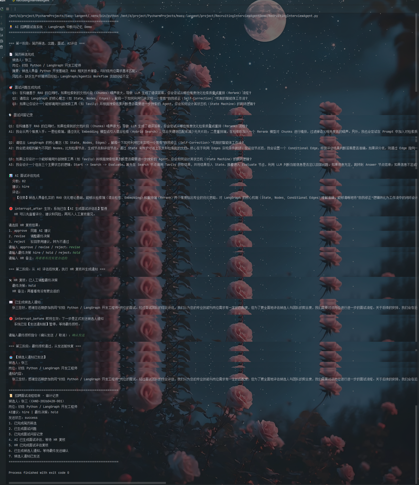

# AI 招聘面试官系统

本项目是一个 LangGraph 综合实践 Demo，结构仿照 `WhoIsTheSpyDemo`：一个主程序文件加一个说明文档，方便直接运行和阅读。

它重点演示第七章中的三个能力：

- `interrupt_after`：AI 生成面试评估后暂停，等待 HR 复核；
- `interrupt_before`：正式发送候选人通知前暂停，等待最终授权；
- `MemorySaver`：用 `thread_id` 保存流程状态，中断后从 checkpoint 恢复。

## 1. 项目目标

系统模拟一个招聘面试流程：

1. 读取候选人简历；
2. AI 筛选简历并提炼风险点；
3. AI 生成面试问题；
4. AI 模拟候选人回答；
5. AI 生成面试评估、评分和录用建议；
6. 在评估完成后暂停，等待 HR 复核；
7. HR 同意、调整或驳回 AI 建议；
8. AI 根据最终决策生成候选人通知；
9. 在正式发送通知前暂停，等待最终授权；
10. 授权后恢复流程并模拟发送通知。

## 2. 项目结构

```text
RecruitingInterviewAgentDemo/
├── Readme.md
└── RecruitingInterviewAgent.py
```

## 3. 工作流节点

| 节点 | 作用 |
| --- | --- |
| `screen_resume` | 分析简历，提取岗位匹配摘要和风险点 |
| `generate_questions` | 根据岗位和简历生成面试问题 |
| `simulate_interview` | 模拟候选人回答，真实系统中可替换成用户输入 |
| `evaluate_candidate` | 生成 AI 面试评估、评分和录用建议 |
| `hr_review` | 接收 HR 人工复核结果 |
| `prepare_notification` | 根据最终决策生成候选人通知 |
| `send_notification` | 模拟发送通知 |
| `show_final_result` | 输出流程审计记录 |

## 4. interrupt_after 的应用

代码中配置：

```python
interrupt_after=["evaluate_candidate"]
```

含义：`evaluate_candidate` 节点执行完成后，流程暂停。

此时 AI 已经生成：

- 面试评估；
- 候选人评分；
- AI 建议：`hire`、`hold` 或 `reject`。

HR 可以查看这些内容，再决定：

- 同意 AI 建议；
- 调整最终决策；
- 驳回录用建议。

这类场景适合 `interrupt_after`，因为人类需要先看到 AI 的输出，再做判断。

## 5. interrupt_before 的应用

代码中配置：

```python
interrupt_before=["send_notification"]
```

含义：流程即将进入 `send_notification` 节点前暂停。

候选人通知一旦发送，就会产生真实业务影响，所以必须在发送前做最终确认。

这类场景适合 `interrupt_before`：

- 发送录用通知；
- 发送拒信；
- 发起退款；
- 发布公告；
- 调用外部系统 API。

## 6. MemorySaver 的应用

代码中使用：

```python
memory = MemorySaver()
app = graph.compile(
    checkpointer=memory,
    interrupt_after=["evaluate_candidate"],
    interrupt_before=["send_notification"],
)
```

每次运行时会生成一个 `thread_id`：

```python
config = {"configurable": {"thread_id": thread_id}}
```

流程中断后，系统不会丢失状态。人工复核意见可以写入 checkpoint：

```python
app.update_state(config, review_update)
```

然后继续恢复执行：

```python
app.stream(None, config=config)
```

最终发送前也可以用同一个 `thread_id` 继续：

```python
app.invoke(None, config=config)
```

## 7. 运行前配置

项目默认读取根目录 `.env`：

```text
API_KEY=你的模型密钥
BASE_URL=https://api.deepseek.com
MODEL=deepseek-chat
```

如果没有配置 `API_KEY`，脚本会使用内置兜底内容演示完整流程，方便先学习中断和恢复机制。

## 8. 运行方式

在项目根目录执行：

```bash
python project/RecruitingInterviewAgentDemo/RecruitingInterviewAgent.py
```

交互流程中会出现两次暂停：

1. AI 评估完成后，要求 HR 复核；
2. 候选人通知发送前，要求最终确认。

也可以使用自动演示模式：

```bash
python project/RecruitingInterviewAgentDemo/RecruitingInterviewAgent.py --auto
```

自动模式会自动同意 AI 建议，并自动确认发送，适合课堂演示或快速验证流程。

## 9. 可扩展方向

你可以继续扩展：

- 把 `simulate_interview` 改成真实用户输入；
- 增加二面、HR 面、终面等多轮面试；
- 将 `MemorySaver` 替换为数据库 checkpoint；
- 把 `send_notification` 对接邮件或企业微信；
- 增加薪资审批节点，录用前再触发一次人工审批；
- 将面试记录写入 JSON 或数据库，形成候选人档案。


## 10. 项目截图


## 11. License

本项目遵循 MIT License，详见 `LICENSE` 文件。
