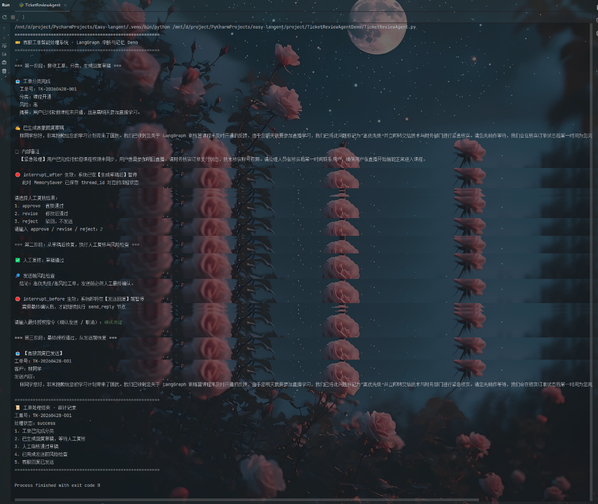

# 客服工单智能处理系统

本项目是第七章 `interrupt_before`、`interrupt_after`、`MemorySaver` 的综合实践案例，项目结构仿照 `WhoIsTheSpyDemo`：一个主程序文件加一个说明文档，便于直接运行和阅读。

## 1. 项目目标

系统模拟一个客服工单处理流程：

1. 接收用户工单；
2. 智能体自动分类并判断风险；
3. 智能体生成客服回复草稿；
4. 在草稿生成后暂停，等待人工复核；
5. 人工通过、修改或驳回；
6. 发送前做风险检查；
7. 在真正发送前再次暂停，等待最终授权；
8. 授权后恢复流程并模拟发送。

这个案例重点不是复杂业务，而是演示 LangGraph 的“可中断、可恢复、可人工介入”的工作流能力。

## 2. 项目结构

```text
TicketReviewAgentDemo/
├── LICENSE
├── Readme.md
├── TicketReviewAgent.py
└── img.png
```

## 3. 核心知识点

### interrupt_after

代码中配置：

```python
interrupt_after=["draft_solution"]
```

含义：`draft_solution` 节点生成回复草稿后，流程立即暂停。人工可以查看草稿，再决定通过、修改或驳回。

适用场景：

- AI 生成邮件草稿后人工检查；
- AI 生成合同条款后法务审核；
- AI 生成客服回复后人工复核。

### interrupt_before

代码中配置：

```python
interrupt_before=["send_reply"]
```

含义：流程即将进入 `send_reply` 节点前暂停。只有人工输入“确认发送”，系统才会继续执行真正的发送动作。

适用场景：

- 发送邮件前确认；
- 执行退款前确认；
- 调用外部 API 前确认；
- 发布内容前确认。

### MemorySaver

代码中配置：

```python
memory = MemorySaver()
app = graph.compile(
    checkpointer=memory,
    interrupt_after=["draft_solution"],
    interrupt_before=["send_reply"],
)
```

`MemorySaver` 会把每次执行的状态保存到 `thread_id` 对应的检查点里。中断后继续执行时，不需要重新跑前面的节点，只需要使用同一个 `thread_id` 调用：

```python
app.invoke(None, config=config)
```

人工审核结果会先写入同一个 checkpoint：

```python
app.update_state(config, {"human_review": "approve"})
```

再从中断点恢复：

```python
app.stream(None, config=config)
```

## 4. 运行前配置

项目默认从根目录 `.env` 读取模型配置：

```text
API_KEY=你的模型密钥
BASE_URL=https://api.deepseek.com
MODEL=deepseek-chat
```

如果没有配置 `API_KEY`，脚本会使用内置兜底内容演示 LangGraph 流程，方便先理解中断和恢复逻辑。

## 5. 运行方式

在项目根目录执行：

```bash
python project/TicketReviewAgentDemo/TicketReviewAgent.py
```

交互流程中，你会看到两次暂停：

1. 回复草稿生成后暂停，要求人工复核；
2. 发送回复前暂停，要求最终确认。

也可以使用自动演示模式：

```bash
python project/TicketReviewAgentDemo/TicketReviewAgent.py --auto
```

自动演示模式会自动通过人工复核，并自动确认发送，适合课堂演示或快速检查流程。

## 6. 工作流节点说明

| 节点 | 作用 |
| --- | --- |
| `classify_ticket` | 分析工单类型、风险等级和摘要 |
| `draft_solution` | 生成客服回复草稿，执行后触发 `interrupt_after` |
| `human_review` | 接收人工审核结果，通过、修改或驳回 |
| `risk_check` | 发送前风险检查 |
| `send_reply` | 模拟发送客服回复，执行前触发 `interrupt_before` |
| `show_final_result` | 输出审计记录 |

## 7. 学习扩展

你可以继续扩展这个 Demo：

- 把 `send_reply` 替换为真实邮件 API；
- 把 `MemorySaver` 换成数据库持久化 Checkpointer；
- 增加“退款审批”“投诉升级”等条件分支；
- 将人工审核结果保存到文件或数据库；
- 增加多轮修改，让人工驳回后重新生成草稿。

## 8.项目截图


## 9. License

本项目遵循 MIT License，详见 `LICENSE` 文件。
